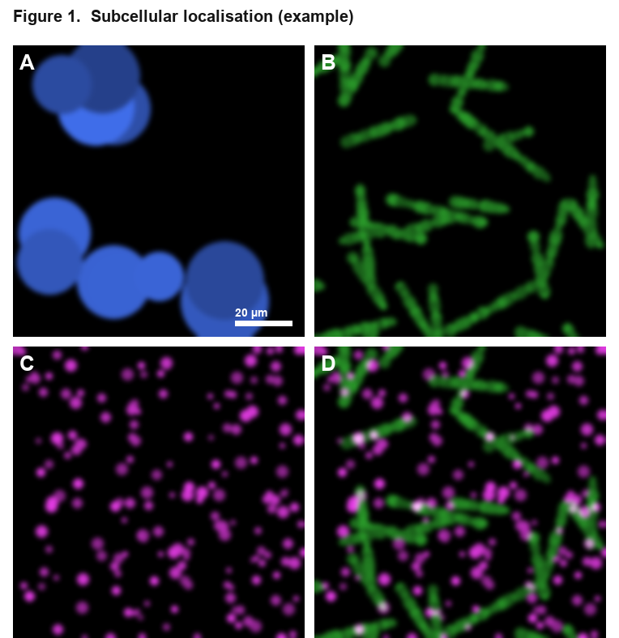
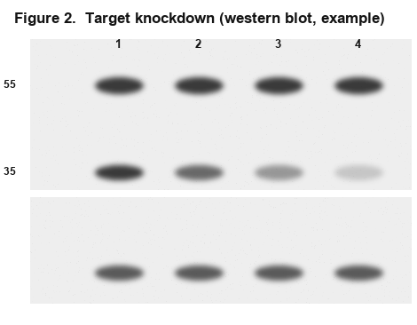

# FigureLab v3.6

[](LICENSE)
[](https://github.com/mbaffour/FigureLab/actions/workflows/ci.yml)
[](https://doi.org/10.5281/zenodo.21269456)

A single HTML file for assembling publication-quality scientific figures. No installation, no server, no internet required — open in any browser and start working.

Works for microscopy images, western blots, histology, gels, clinical photos, or any image-based figure.

*Built with passion for science and discovery.*

---

## Screenshots

A figure assembled and exported entirely in the browser (via **✨ Load example figure**):

<table>
<tr>
<td width="55%"></td>
<td width="45%"></td>
</tr>
<tr>
<td><em>Fluorescence 2×2 (DAPI / GFP / mCherry / merge) with A–D labels and a calibrated scale bar. The colourblind-safe magenta/green merge shows colocalization in white.</em></td>
<td><em>Western-blot layout with lane numbers, an MW ladder, and a loading-control panel — assembled and exported in the browser.</em></td>
</tr>
</table>

<!-- To add live UI screenshots, drop empty-state.png / export-preflight.png into docs/screenshots/: open the app and use your OS screenshot tool. -->

## Quick Start

1. Open `figure_lab.html` in your browser (Chrome or Firefox recommended)
2. Drag images onto the drop zone, or click to browse
3. Adjust the grid layout, labels, and scale bars
4. Click **⟳ Render** (or press **R**) to preview
5. Export in your chosen format

---

## Simple vs Advanced mode

FigureLab opens in **Simple mode** — the header pill (top-right) toggles between Simple and Advanced, and your choice is remembered between sessions.

- **Simple** shows the core workflow only: import images, choose a layout or template, panel labels, scale bars, basic crop and brightness/contrast, annotate, and export.
- **Advanced** additionally reveals: AI image generation, freeform canvas mode, scale-matching, batch crop, histogram normalization, the deep figure audit / exposure analysis / panel comparison, measurement tools (ROI / line profile / count), reproducibility scripts (R / Python) and the reproducibility log, and multi-page PDF export.

Advanced tools are only *hidden*, never removed — switching back to Advanced restores everything exactly, and nothing about your figure or its export changes with the mode. You can also toggle it from the command palette (<kbd>Ctrl</kbd>/<kbd>⌘</kbd>+<kbd>K</kbd> → "Toggle Simple / Advanced").

## On-device AI

The **caption helper** can optionally polish your figure legend with AI that runs **entirely in your browser, on your own machine** — no server, no API key, nothing uploaded. It uses **Chrome's built-in Prompt API (Gemini Nano)**, the browser-native on-device model, so it fits FigureLab's offline/privacy promise exactly.

- Click **🤖 Polish with on-device AI** under the caption helper.
- It's **feature-detected**: if your browser doesn't expose the built-in model (`window.LanguageModel`), FigureLab silently keeps the built-in rule-based caption — the feature never blocks anything or requires a network.
- An echo/guard check rejects degenerate responses, so a good caption is never clobbered.
- Requires a recent Chrome (138+) with built-in AI enabled; the ~4 GB model downloads once, then works fully offline.

*Why not Google AI Edge / MediaPipe LLM Inference directly?* That path can run open models (Gemma) in-browser via a WASM runtime, but it means bundling a multi-megabyte runtime + model weights, which breaks the "single HTML file, no dependencies" identity. The Chrome built-in Prompt API gives the same **on-device, private** benefit with **zero bundled dependencies** — the right trade-off here. (If you ever want a fully browser-agnostic option, a MediaPipe/Transformers.js build could be offered as a separate opt-in bundle.)

## What's in v3.0

### Core Layout
| Feature | Details |
|---|---|
| Grid layout | Rows × columns with independent horizontal and vertical gap control |
| Drag-to-space | Hover between panels on the canvas and **drag the divider** (or tap **+ / −**) to space them out live |
| Per-gutter spacing | Turn on **Per-gutter spacing** to give individual rows/columns their own gap; **Reset gutters** returns to uniform |
| Per-panel crop | Trim each edge by % — or use the interactive crop editor |
| Panel labels | Format as A/B/C, a/b/c, 1/2/3, or i/ii/iii — with position, size, colour, font, bold/italic |
| Panel border | Optional border around each panel (width + colour) |
| Scale bars | Per-panel enable/disable, µm/nm/mm auto-formatted label |
| Axis labels | Optional row and column headers with custom text |
| Figure title | Optional title rendered above the figure |
| Journal presets | One-click settings for Nature, Science, Cell, and Poster |
| Light / dark mode | Toggled from the header |

### Per-Panel Adjustments
| Control | Details |
|---|---|
| Brightness / Contrast | Sliders with live preview |
| Gamma correction | Nonlinear tone adjustment — useful for dim fluorescence images |
| Grayscale / Invert | One-click toggles |
| Black / White point | Clip and stretch the intensity range |
| Fluorescence LUTs | Fire, Green, Cyan, Magenta, Yellow, Blue |
| Multi-channel composite | Add extra channels with independent LUTs (screen blend) |
| Rotate | 90° CCW, CW, 180° |
| Flip | Horizontal and vertical |
| Lock panel | Prevents accidental drag-reorder |

### Scale Calibration Tool
Click **🔬 Calibrate from image** inside any panel's settings. Click two known points on the image, enter the real-world distance, and the µm/px ratio is calculated automatically. Objective presets (4× – 100×) are also available.

**Auto scale bar:** click the **Auto SB** button on any panel to automatically pick a clean scale bar length (≈ 20% of panel width).

### Annotation Tools
Draw directly on the rendered figure:
- **Arrow** — single-headed; points to features
- **Arrow2** — double-headed; spans a distance
- **Ruler** — line with tick marks at each end; labels µm length if calibrated
- **Rectangle** — highlight regions; optional filled with adjustable opacity
- **Ellipse** — outline structures; optional filled with adjustable opacity
- **Line** — measure or indicate
- **Text** — free-form labels; font, size, and colour controlled in the float toolbar
- **Inset** — magnify a region; automatically placed in a panel corner
- **Counter** — click to place numbered dots; running count shown while tool is active

**Editing annotations:**
- Switch to **↖ Select** (or press **Esc**) to enter select mode
- **Click** any annotation to select it — a golden highlight appears
- **Drag** to reposition; drag corner handles to resize
- A **floating toolbar** sets colour, line width, font size, fill, and opacity
- **Delete** from the toolbar or the annotation list in the sidebar

**Drawing tips:**
- Hold **Shift** while drawing to snap lines/arrows to 45° increments, or to force squares/circles
- **Panel annotations** (📌 mode) pin annotations to a specific panel — they follow it when panels are reordered

**Undo / Redo** — full history for all annotation actions

### Canvas Navigation
| Action | How |
|---|---|
| Zoom in/out | Ctrl + scroll wheel, or ＋/－ buttons |
| Pan | Space + drag |
| Zoom to fit | **⊡ Fit** button |
| Zoom to 100% | **1:1** button |
| Copy figure | **⎘ Copy** button — copies to clipboard as PNG |
| Reset zoom | Click the **100%** zoom button |

### Export Formats
| Format | Notes |
|---|---|
| PNG | Lossless, DPI metadata embedded via pHYs chunk |
| JPEG | Smallest file size |
| WebP | Good balance of quality and size |
| TIFF | Uncompressed RGB, scaled to target DPI — journals prefer this |
| PDF | Embedded raster at correct physical size |
| SVG | Background raster + vector annotations as native SVG elements |

Set a **file name** and **DPI** (72 / 150 / 300 / 600) before exporting. TIFF is scaled from screen resolution to the target DPI so the pixel dimensions are correct for print.

The info bar below the canvas shows both pixel dimensions and physical size in mm at the current export DPI.

### CSV Metadata Export
Click **⬇ CSV Metadata** to export a spreadsheet of all panel settings — name, label, µm/px, scale bar, brightness, gamma, crop, caption, and metadata notes. Useful for methods sections and lab records.

### Reproducibility Scripts
Export an **R script** (uses `magick`) or **Python script** (uses `Pillow + matplotlib`) that recreates the figure from your original image files.

### Caption Generator
Add a short note to each image in its settings panel, then click **✦ Generate Caption** to produce a structured journal-style caption:

> Figure. Effect of treatment. (A) Control cells. Scale bar, 10µm. (B) Treated cells. Scale bar, 10µm.

### Session Save / Load
Save the entire figure — layout, per-panel settings, annotations, notes, **and the image pixels** — as a JSON file and reload it later to restore everything exactly, no re-dropping required. (Sessions saved by very old versions, before pixel data was embedded, will prompt you to re-drop those images.)

### Notes Scratchpad
Expand the **Export** panel to find a **Figure notes** text area — write antibody dilutions, reviewer comments, or anything else that should travel with the session file.

---

## Keyboard Shortcuts
| Key | Action |
|---|---|
| R | Render figure |
| Esc | Exit tool / deselect |
| Ctrl + Z | Undo |
| Ctrl + Y | Redo |
| Ctrl + Shift + Z | Redo (alternate) |
| Ctrl + S | Save session JSON |
| Space + drag | Pan canvas |
| Shift + draw | Snap to 45° / square |

---

## Scale Bar Formula

```
display pixels = (µm length ÷ µm/px) × (display width ÷ original width)
```

**Objective presets (approximate):**
| Objective | µm/px |
|---|---|
| 4× | 1.62 |
| 10× | 0.65 |
| 20× | 0.32 |
| 40× | 0.16 |
| 60× | 0.108 |
| 100× | 0.065 |

---

## Common tasks

- **Space two panels apart** — hover the seam between them; a blue divider with a `gap` pill appears. Drag it (or tap **+**) to push them apart. Drag a horizontal seam for row spacing, a vertical seam for column spacing.
- **Give one row extra breathing room** — tick **Per-gutter spacing** in the Layout panel, then drag only the gutter under that row. Everything else stays tight. **Reset gutters** restores a uniform grid.
- **Drop labels in one click** — click **⊞ Labels** in the canvas toolbar (or the small **×** chip in the figure's top-left) to add or remove row & column headers instantly.
- **Write directly on an image** — double-click a panel, type your text, press **Enter**. The label is pinned to that panel (it follows the panel if you reorder) and gets a dark **halo** so it stays readable over bright micrographs. Toggle the halo from the floating toolbar.
- **Export print-ready** — set DPI to 300–600 and export PNG/JPEG/WebP: the figure is re-rendered at the true pixel count (supersampled), so text, scale bars, and lines stay crisp — not just DPI-tagged.

## Tips

- **Drag the ⠿ handle** in the image list to reorder panels (locked panels cannot be moved)
- **Apply to all** copies brightness, contrast, gamma, LUT, and B/W points from one panel to all others
- **Duplicate** a panel (⎘ button) to reuse its settings for similar images
- Use the **mini grid map** in the Layout section to see panel assignments at a glance
- Annotations are baked into the exported figure — finalise the layout before annotating
- For journal submission, use TIFF at 300–600 DPI with a white background
- The **uncalibrated warning badge** (⚠) appears on scale bars when µm/px is not set

---

## Technical Notes

- Everything runs in the browser — no data ever leaves your computer
- Raster export (PNG/JPEG/WebP): the figure is re-rendered off-screen at the true target-DPI pixel count (supersampled, high-quality smoothing), so output is genuinely high-resolution — capped at ~60 megapixels to stay within browser memory
- TIFF export: uncompressed RGB, scaled to target DPI (not just metadata — actual pixel count is correct)
- PNG export: DPI and reproducibility metadata embedded; correct DPI in Photoshop / ImageJ
- PDF export: JPEG-compressed raster at correct physical page size
- SVG export: background PNG + native SVG shapes for vector annotations
- Gamma correction uses a 256-entry LUT computed once per render for speed
- Fonts: JetBrains Mono, Instrument Serif (loaded from Google Fonts if online, falls back to system fonts offline)

---

## Changelog

### v3.6 — 10 July 2026
**Focus: a friendly, direct-manipulation figure editor + opening the image formats scientists actually have — same single file, still offline & private.**

- **Friendly figure editor (Freeform mode)** — click-to-select, drag-to-move, handle resize (aspect-locked for images), and a **rotate handle** that snaps to 0/45/90°. Objects **snap into alignment** with live magenta guides, and a floating context toolbar puts duplicate, lock, layer order & delete next to the selection.
- **Per-object text** — double-click text to edit it in place; set font family, size, bold/italic, colour and alignment per object.
- **Cover patch** 🩹 — the integrity-safe way to hide or replace baked-in text: an opaque, movable object (with *match background*) you type new text over. Reversible and recorded in the session — never a hidden pixel edit.
- **TIFF import** — a dependency-free, client-side decoder opens `.tif/.tiff` that browsers can't (Chrome/Edge/Firefox): uncompressed, LZW, PackBits & Deflate; 8/16-bit & 32-bit float; grayscale, RGB, RGBA, CMYK & palette; strips or tiles; little/big-endian; horizontal-differencing predictor. Verified pixel-exact against a `tifffile`-generated fixture matrix.
- **SVG stays vector** — imported SVGs keep their vector source (crisp at any size) and **re-export as vector** in SVG output, editable in Illustrator/Inkscape.
- **Save dialog** — every export opens a dialog to set name, format & DPI first; on Chrome/Edge you choose the folder in the OS's native Save window.
- **Duplicate** (`Ctrl+D`), **lock**, and multi-object layer ordering for Freeform objects.

_v3.6 is the current development version. The published, citable release remains v3.5 (DOI below); a v3.6 DOI will be minted when it's tagged on Zenodo._

### v3.5 — 8 July 2026
**Focus: UI/UX clarity, onboarding, scientific integrity, and export reliability — without changing the single-file, offline, privacy-first identity.**

- **Submission package** — a `📦 Export submission package (ZIP)` button bundles everything a journal or lab needs into one archive: PNG, uncompressed TIFF, lossless PDF, SVG, session JSON (images embedded), metadata CSV, caption, figure notes, R + Python scripts, reproducibility log, each panel as a separate PNG, and a provenance manifest. Built on a dependency-free client-side ZIP writer.
- **Editable PowerPoint (.pptx) export** — `📊 Export editable PowerPoint` writes an OOXML deck where each panel is a separate, movable picture at its real position and the title is an editable text box — finish the figure in PowerPoint. Fully offline, no dependencies.
- **Smart image import** — image cards show pixel dimensions, aspect ratio, a channel chip detected from the filename (DAPI/GFP/mCherry/Cy5/phase/merge), and a duplicate-name warning; **Sort by name** natural-sorts and relabels, **Auto-channels** assigns colourblind-safe LUTs from the detected channels.
- **Split-channel row** — one click explodes a multi-channel composite into separate single-channel panels (each with its LUT and a channel caption) plus a merge.
- **Matched / linked panels** — assign panels a *Match group* and **⇉ Sync group** copies brightness/contrast/gamma/LUT/levels/scale-bar length across the whole comparison group, so it's processed identically (integrity-safe).
- **Gel/blot splice marker** — drop a visible lane-divider line where blot lanes were spliced (a journal requirement), under Annotate → Blot/gel tools.
- **House styles** — save your lab's *look* (background, label font/size/colour/format, scale-bar style, panel border, typography) and apply it to any figure in one click, so every figure in a paper matches. (Distinct from Templates, which save layout.) Under Style → House styles.
- **On-device AI caption polish** (optional) — a `🤖 Polish with on-device AI` button refines your figure legend using **Chrome's built-in Gemini Nano (Prompt API)**, running *entirely on your machine* so nothing is uploaded. Feature-detected; falls back to the rule-based caption when unavailable. See *[On-device AI](#on-device-ai)*.
- **"What's New" tab** in Help with the dated changelog, plus a "new" dot on the header ❔ after an update.

- **Simple / Advanced mode** — a header toggle (default **Simple**) hides advanced tools (AI generation, freeform, measurement, histogram normalization, deep audit, reproducibility scripts, multi-page PDF, scale-matching) behind one switch, so beginners see only the core workflow. Nothing is removed from the DOM; preference persists. See *[Simple vs Advanced mode](#simple-vs-advanced-mode)*.
- **Empty-state start screen** — a blank canvas now shows a launchpad: drop images, start from a template, load a session, or try the example figure, plus an `Import → Layout → Calibrate → Annotate → Audit → Export` workflow strip.
- **Load example figure** — one click generates four procedural micrographs (DAPI / GFP / mCherry / merge) in a labelled, scale-barred 2×2 so you can explore instantly with no files. Clear with one undo.
- **Command palette** — <kbd>Ctrl</kbd>/<kbd>⌘</kbd>+<kbd>K</kbd> opens a fuzzy launcher for every action (render, all exports, audit, save/load, presets, match scale, batch crop, toggle mode, help…).
- **Export preflight** — the Export-panel format buttons show format, file name, DPI, final pixel dimensions, physical size (mm + in), estimated file size, vector-vs-raster status, and integrity warnings before you commit. (Toolbar **Quick** buttons still export instantly.)
- **Colour-vision-deficiency (CVD) simulation** — a `👁 CVD` toolbar selector previews the figure as deuteranope / protanope / tritanope viewers see it, to self-check that fluorescence merges stay distinguishable. Display-only — exports are never altered.
- **Colourblind-safe default LUTs** — new multi-channel merges default to magenta/green rather than red/green.
- **Contextual `?` info chips** — plain-language, methods-aware explanations on Export DPI, formats, panel labels, scale bars, per-panel adjustments, and LUTs. Keyboard-accessible.
- **Auto-arrange panels** — proposes a balanced grid, even gutters, and labels for the current panel count. Undoable.
- **Lossless PDF export** — alongside the standard JPEG-based PDF, a Flate-compressed lossless PDF for line art and blots; both now export at the true target DPI (previously screen resolution).
- **In-app Help & FAQ** — a tabbed Help modal (Getting Started · Use Cases · FAQ) reachable from the header `❔` and footer.
- Docs/accuracy: version unified via a single `APP_VERSION`; corrected the outdated "images aren't saved" note (sessions embed images — see [Session save](#session-save--load)); added a `CITATION.cff` / Zenodo metadata for citing the tool; CI runs the Playwright suite (now 33 tests).

**Also in v3.5 (workflow, integrity & onboarding):**
- **Full-session autosave & crash recovery** — a debounced snapshot to local storage (with a "last autosaved" status and on/off toggle) offers to recover your work after an accidental close.
- **Actionable journal audit** — the compliance check adds scale-bar calibration, adjustment-sanity, and export-size checks, each with a one-click fix (Set 300 DPI, Make white, Calibrate, Show labels).
- **Before/after adjustment slider** — a per-panel wipe between original and adjusted pixels.
- **Layer panel** — rename / hide / lock annotations.
- **Matched panels** now also sync crop and physical field of view; **western-blot mode** adds lane labels, an MW ladder, and a blot-metadata CSV (with the splice marker).
- **Smart import** gains a filename pattern parser (`condition_time_channel_rep`); **crop editor** gains arrow-key nudge and copy-crop-to-group/all.
- **More journal presets** (eLife, PLOS, EMBO, PNAS); **lightweight vs bundled** session saves; **house-style** presets.
- **First-run guided tour**, **PWA install** (over http/https), **SHA-256 provenance stamp** in export metadata, and **sRGB** colour tagging in PNGs.

**Make it yours:**
- **Session library** — keep multiple named figures in your browser (IndexedDB, with thumbnails) and switch between them: save the current figure, then open / update / rename / delete any of them from Export → My sessions. All local.
- **Personalized welcome** — the start screen greets you by name and time of day. Set your name, theme, and the animated background from **⚙ Customize** (also in the command palette).
- **Animated science background** — the drifting bio-graphics behind an empty canvas now include molecules and cells alongside phage, bacteria, DNA, and vesicles. Toggleable, and it respects `prefers-reduced-motion`.

### v3.4
- **Crisp on-screen preview on HiDPI displays** — a separate high-resolution display layer renders the figure at devicePixelRatio once editing settles, so panel labels, scale bars, and annotations stay sharp when zoomed in. The figure buffer that measurements and exports read is left at logical resolution and untouched, so quantification stays exact
- **Universal undo/redo** — Ctrl+Z / Ctrl+Y now cover layout (grid size, gaps, margins, gutters), per-panel adjustments (brightness/contrast/gamma/LUT/levels/crop/rotate/flip), panel add/delete/duplicate/reorder, label toggles, and annotations — not just annotations. One undo step per edit gesture
- Reliability & UX hardening: corrupt-file and clipboard/export error toasts, export progress indicator, "render outdated" cue, first-run tips, confirm on Apply-to-all
- Performance: per-panel adjustment cache + rAF-coalesced renders for smooth slider dragging
- Accessibility: visible focus rings, aria-labelled icon buttons, on-screen-clamped floating toolbar, higher-contrast theme text

### v3.3
- **Drag-to-space gutters** — hover between panels and drag the divider (or tap + / −) to set spacing directly on the canvas
- **Per-gutter spacing** mode for independent row/column gaps, with one-click reset to uniform
- **One-click label toggle** — ⊞ Labels toolbar button and an on-canvas × chip
- **Double-click to add text** onto any panel, with an inline editor and a readability halo (also exported to SVG)
- **True high-resolution raster export** — PNG/JPEG/WebP re-rendered at the real target-DPI pixel count, with high-quality image smoothing throughout

### v3.0
- Rotate and flip per panel
- Gamma correction slider
- Auto scale bar (picks a clean µm value)
- Apply settings to all panels
- Double-headed arrow (Arrow2) annotation
- Ruler annotation with tick marks
- Cell counter tool
- Filled rect/ellipse with opacity
- Shift-key snap (45° angles, square shapes)
- Label format selector (A/a/1/i)
- Panel border styling
- CSV metadata export
- Zoom to fit / 1:1 / Copy to clipboard buttons
- Empty panel slot shows dashed border and slot number
- Info bar shows physical size in mm
- Print-ready CSS (`Ctrl+P` hides all UI chrome)
- Notes scratchpad saved in session JSON
- Lock panel to prevent drag-reorder
- Fix: annotation drag is smooth (live preview on overlay canvas)
- Fix: TIFF exports at correct DPI (pixel count scaled, not just tag)
- Fix: SVG export uses native vector elements for annotations

### v2.0
- Full annotation system (arrow, rect, ellipse, line, text, inset)
- Panel annotations pinned to individual panels
- Interactive crop editor
- Multi-channel fluorescence composite
- Fluorescence LUTs
- Black/white point clipping
- Calibration tool
- Journal compliance checker
- Undo/redo history
- Reproducibility R/Python scripts

---

## Citation

If you use FigureLab in your research, please cite it. Metadata lives in
[`CITATION.cff`](CITATION.cff), so GitHub shows a **"Cite this repository"**
button automatically.

> Awuah, M. B. (2026). *FigureLab: a browser-based tool for assembling
> publication-quality scientific figures* (Version 3.5) [Computer software].
> Zenodo. https://doi.org/10.5281/zenodo.21269456

**BibTeX:**

```bibtex
@software{awuah_figurelab_2026,
  author    = {Awuah, Michael Baffour},
  title     = {{FigureLab: a browser-based tool for assembling publication-quality scientific figures}},
  year      = {2026},
  version   = {3.5},
  publisher = {Zenodo},
  doi       = {10.5281/zenodo.21269456},
  url       = {https://github.com/mbaffour/FigureLab}
}
```

The DOI above is the **concept DOI** — it always resolves to the latest version.
To cite this exact release, use the v3.5 DOI [`10.5281/zenodo.21269457`](https://doi.org/10.5281/zenodo.21269457).

---

Free and open-source for scientists.
